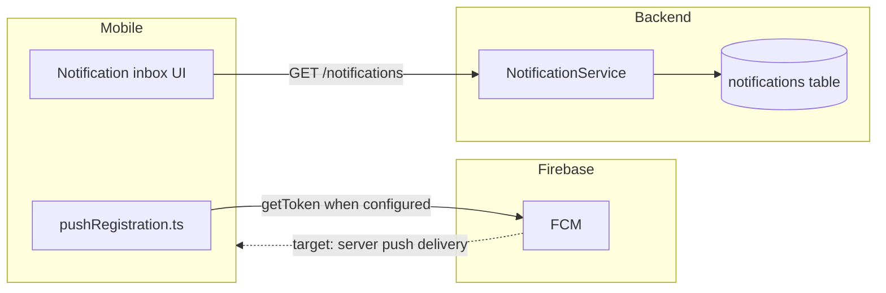

# Firebase

## Purpose

**Firebase Cloud Messaging (FCM) only** — push notifications on Android.

Firebase is **not** used for user identity. Google Sign-In uses Google Cloud OAuth (`GOOGLE_WEB_CLIENT_ID`) via `@react-native-google-signin` — see [REACT_NATIVE.md](./REACT_NATIVE.md) and [AUTH_FLOW.md](../docs/architecture/AUTH_FLOW.md).

## Scope

Mobile FCM setup, device token registration, and how push relates to the in-app notification inbox.

## Packages

- `@react-native-firebase/app` 25.1.0
- `@react-native-firebase/messaging` 25.1.0

## Architecture

| Layer | Today | Target |
| --- | --- | --- |
| **In-app inbox** | Backend persists notifications; mobile lists via API | Same |
| **Device token** | Registered on device after auth; stored in AsyncStorage | Post token to backend for FCM targeting |
| **FCM delivery** | Stub when Firebase not configured | Backend sends push via FCM Admin SDK on booking/verification events |

Push is for **awareness**; chat message bodies are fetched via REST polling ([ADR-0005](../decisions/ADR-0005-chat-transport-v1-rest-polling.md)). Full event list: [NOTIFICATIONS.md](./NOTIFICATIONS.md).

## Mobile flow

1. User authenticates → `flow.tsx` calls `registerPushAfterAuth()`
2. `src/notifications/pushRegistration.ts`:
   - If `FCM_SENDER_ID` is missing or `replace-me` → **stub token** (local dev, no Firebase project)
   - If configured → request permission → `messaging().getToken()` → store in AsyncStorage
3. Inbox screens read notification history from backend API (independent of push delivery)

## Enable live FCM (dev / prod)

1. Create a Firebase project (Android app with package `com.driverbookingmobile`)
2. Download `google-services.json` → `driver-booking-mobile/android/app/` (do not commit secrets to public repos)
3. Apply the React Native Firebase Android setup (Google Services Gradle plugin) per upstream docs
4. Set `FCM_SENDER_ID` in mobile `.env` from the Firebase project settings (numeric sender ID)
5. Rebuild: `npm run android`

Until steps 1–4 are done, the app runs in **stub push mode** without failing auth or inbox flows.

## Configuration

| Item | Location |
| --- | --- |
| Sender ID env var | `FCM_SENDER_ID` in `.env` → `config/env.ts` |
| Token registration | `src/notifications/pushRegistration.ts` |
| Post-auth hook | `registerPushAfterAuth()` in `src/state/flow.tsx` |
| Inbox UI | `src/notifications/NotificationsScreen.tsx`, role-specific notification screens |
| Android package | `com.driverbookingmobile` |

Use separate Firebase projects for **dev** and **prod** when moving beyond local stub mode.

## Backend (inbox today)

`NotificationService` creates and lists in-app notification records. Server-side FCM send (Firebase Admin SDK + stored device tokens) is the planned complement to mobile token registration — not required for inbox-only QA.

## Related

- [NOTIFICATIONS.md](./NOTIFICATIONS.md)
- [REACT_NATIVE.md](./REACT_NATIVE.md)
- [ADR-0005](../decisions/ADR-0005-chat-transport-v1-rest-polling.md)
